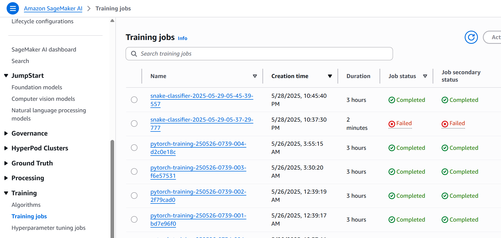
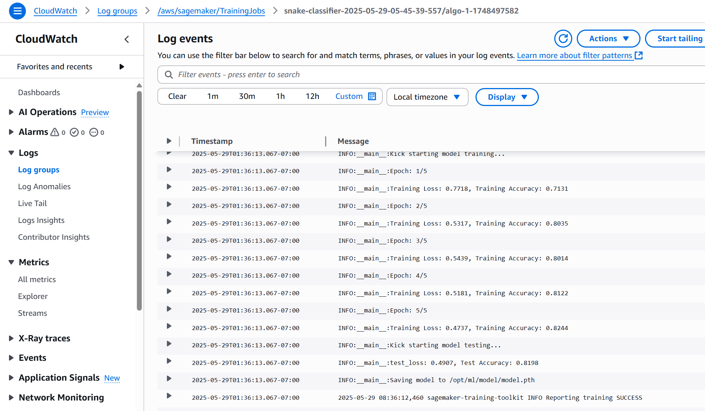
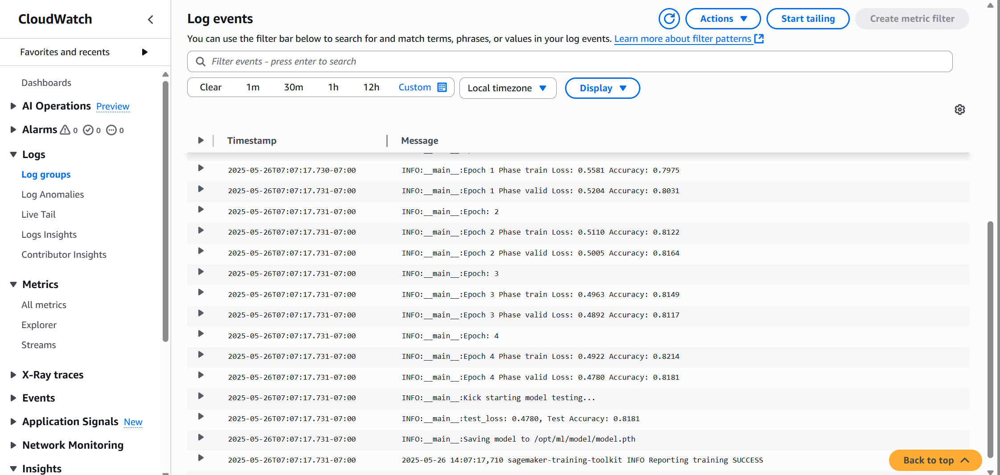
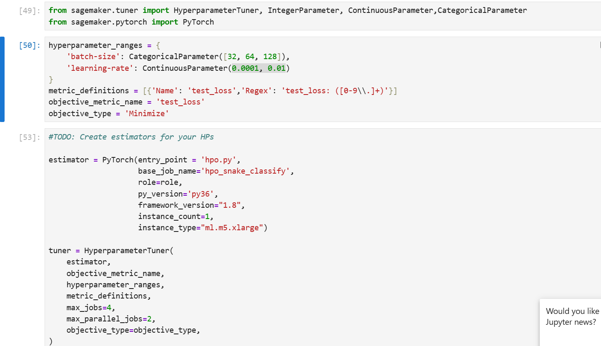
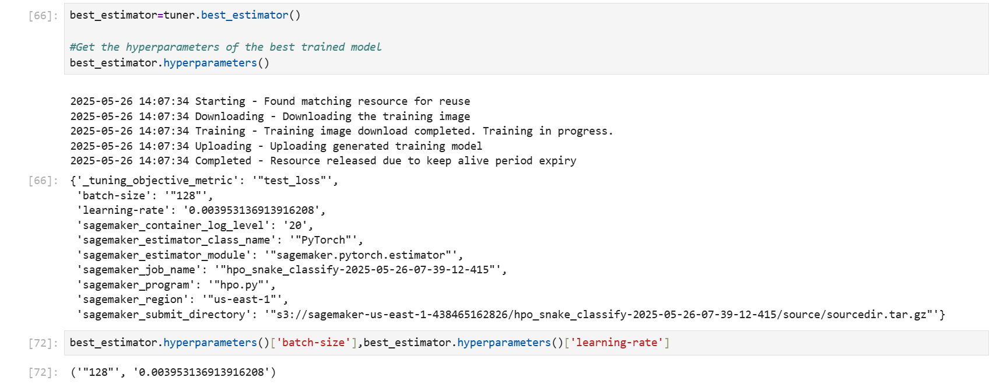
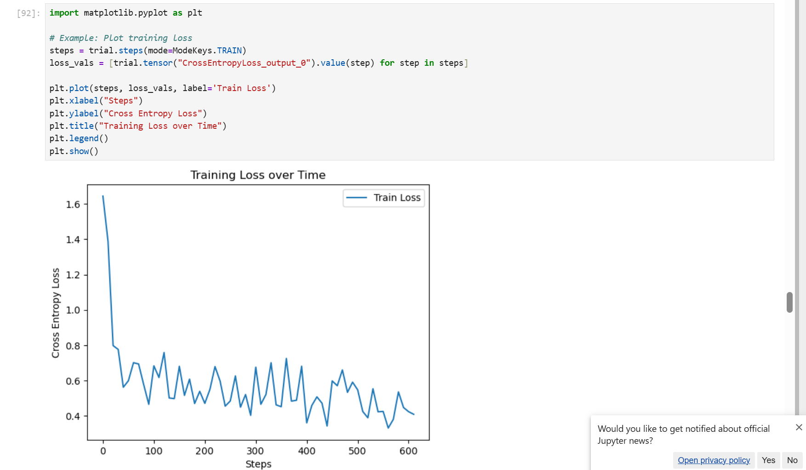

# Image Classification using AWS SageMaker

Use AWS Sagemaker to train a pretrained model that can perform image classification by using the Sagemaker profiling, debugger, hyperparameter tuning and other good ML engineering practices. This can be done on either the provided dog breed classication data set or one of your choice.

## Project Set Up and Installation
Enter AWS through the gateway in the course and open SageMaker Studio. 
Download the starter files.
Download/Make the dataset available. 

## Dataset
The provided dataset is the dogbreed classification dataset which can be found in the classroom.
The project is designed to be dataset independent so if there is a dataset that is more interesting or relevant to your work, you are welcome to use it to complete the project.

### Access
Upload the data to an S3 bucket through the AWS Gateway so that SageMaker has access to the data. 

## Hyperparameter Tuning
I chose to finetune the resnet50 model due to its relevance to image classification. The data had 5 classes, so I attached a linear layer with outcome size of 5. I chose to tune hyper parameters related to learning rate in the range from 0.0001 to 0.01 and batch size in the range of [32, 64, 128]

Screenshot of completed training jobs:

 

The one named ‘snake-classifier-‘ is the training job with best parameters. The others are hyperparameter training jobs

- Logs metrics during the training process

 
- Tune at least two hyperparameters

- Retrieve the best best hyperparameters from all your training jobs

## Debugging and Profiling
Using smdebug library debugging and profiling was done. The following rules were added
rules = [
    Rule.sagemaker(rule_configs.vanishing_gradient()),
    Rule.sagemaker(rule_configs.overfit()),
    Rule.sagemaker(rule_configs.overtraining()),
    ProfilerRule.sagemaker(rule_configs.ProfilerReport())
]
collection_configs = [
    CollectionConfig(
        name="train_loss",  # Custom collection for training loss
        parameters={"include_regex": ".*CrossEntropyLoss_output.*", "save_interval": "10"}
    ),
    CollectionConfig(
        name="eval_losses",  # Custom collection for evaluation loss
        parameters={"include_regex": ".*CrossEntropyLoss_output.*", "save_interval": "10"}
    )]
Hooks were also added to train_model.py

The results were as follows

### Results
What are the results/insights did you get by profiling/debugging your model?
As seen above the training loss decreased with each step which is a good sign

## Model Deployment
Give an overview of the deployed model and instructions on how to query the endpoint with a sample input.
Since sagemakers default handlers did not work for image input I had to define my own inference.py to tweak the model_fn(),input_fn(), predict_fn() and output_fn() with my own custom functions to transform the input image and also the serve the outputs in an understandable way. I also had to define the serializer for reading image input and a reserialize to output a string since the defaults threw an error. With all this the model was deployed to the following endpoint in S3:

Endpoint:

Querying from Endpoint:

